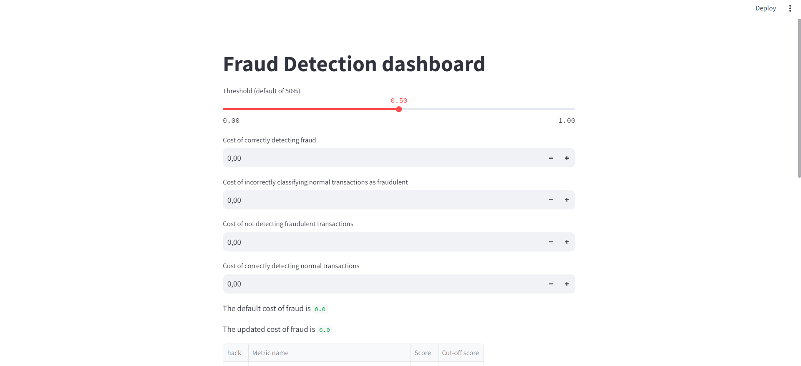
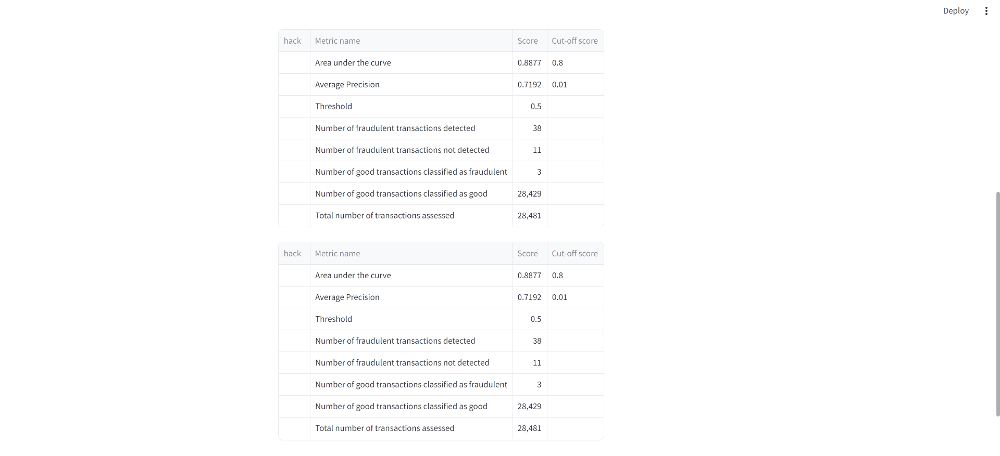

<h1 align="center">Hi guys) I am a Data scientist Inna
</h1>

<h3 align="center">I suppose, fraud detection is one of the main topic in real world.  My project can show how much cost mistakes with it.
I created XGBoost model for prediction and demonstrate it through Streamlit.
</h3>

<h3> 1. Change threshold understanding "fraud".</h3>

<h3> 2. Change price of:   * 'Cost of correctly detecting fraud' , 
* 'Cost of incorrectly classifying normal transactions as fraudulent', 
* 'Cost of not detecting fraudulent transactions', 
* 'Cost of correctly detecting normal transactions'. </h3>

<h3> 3. Get results)
</h3>

